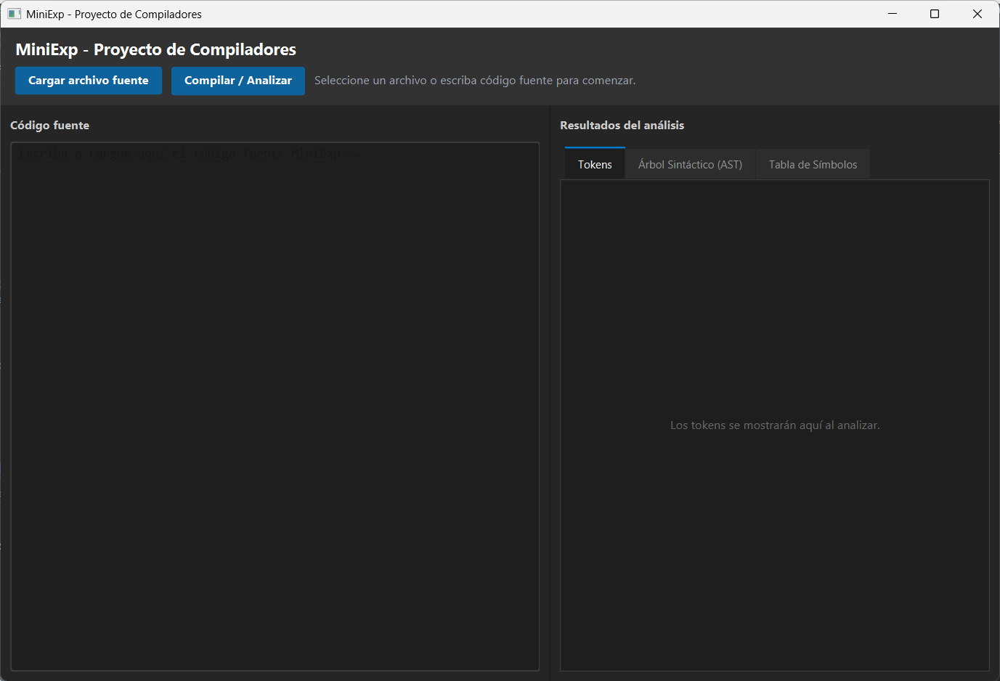
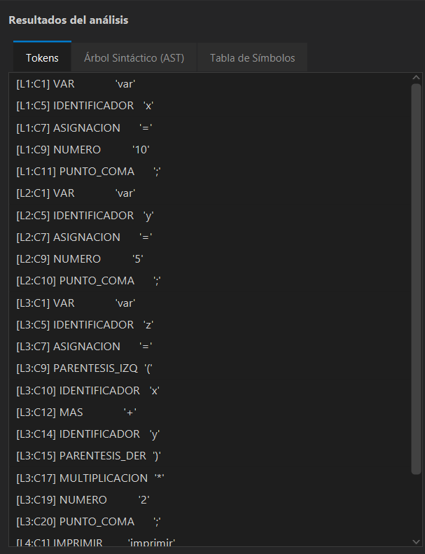
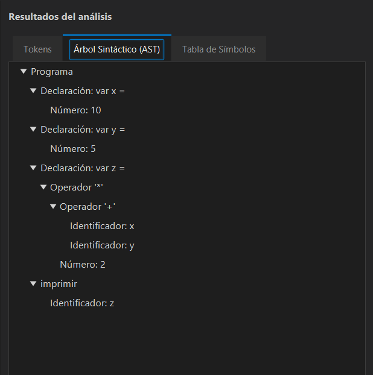
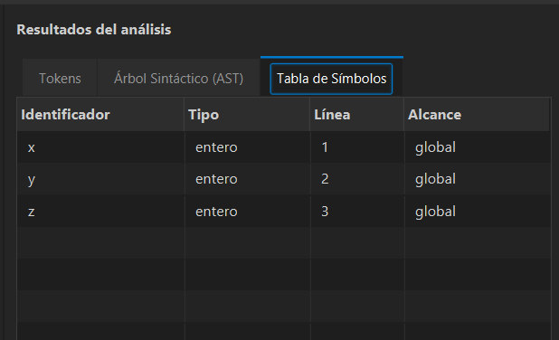
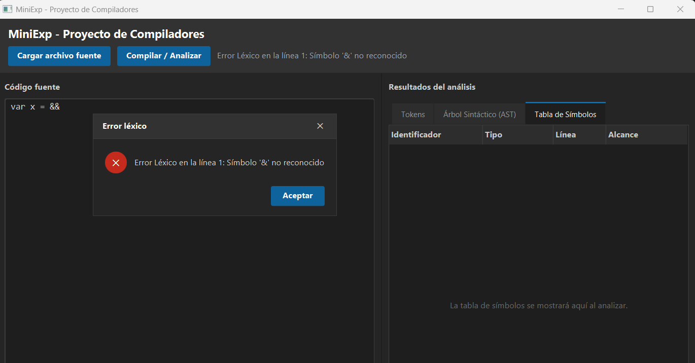

# MiniExp - Proyecto de Compiladores

MiniExp es una aplicación de escritorio hecha en Java 21 y JavaFX para mostrar, de forma visual, las primeras fases de un compilador. El programa permite escribir o cargar código fuente de un lenguaje pequeño, analizarlo y ver el resultado separado en tokens, árbol sintáctico y tabla de símbolos.

El proyecto fue desarrollado como parte del curso de Compiladores. Su objetivo no es ejecutar programas completos, sino demostrar cómo se construyen las piezas base de un compilador: análisis léxico, análisis sintáctico, construcción de AST y validación semántica básica.

## Qué hace el proyecto

- Lee código fuente escrito en el lenguaje MiniExp.
- Convierte el texto en una lista de tokens.
- Construye una tabla de símbolos usando `HashMap`.
- Valida declaraciones y uso de variables.
- Analiza expresiones aritméticas con precedencia de operadores.
- Genera un Árbol de Sintaxis Abstracta (AST).
- Muestra errores léxicos, sintácticos y semánticos desde la interfaz.

## Lenguaje soportado

MiniExp trabaja con variables enteras, asignaciones, expresiones aritméticas e impresión de resultados. La sintaxis principal es:

```text
var x = 10;
var y = x * 2 + 5;
imprimir y;
```

Elementos reconocidos:

- Declaración de variables con `var`.
- Asignación con `=`.
- Impresión con `imprimir`.
- Números enteros.
- Identificadores que empiezan con letra.
- Operadores `+`, `-`, `*`, `/`.
- Paréntesis para agrupar expresiones.
- Punto y coma al final de cada sentencia.

La gramática implementada es:

```text
Program     -> Statement*
Statement   -> Declaration | Assignment | Print
Declaration -> "var" ID "=" Expression ";"
Assignment  -> ID "=" Expression ";"
Print       -> "imprimir" Expression ";"

Expression  -> Term ( ("+" | "-") Term )*
Term        -> Factor ( ("*" | "/") Factor )*
Factor      -> NUM | ID | "(" Expression ")"
```

## Tecnologías utilizadas

- Java 21
- JavaFX 21
- FXML
- Maven
- `ArrayList` para tokens y nodos
- `HashMap` para la tabla de símbolos
- `TreeView` para mostrar el AST
- `TableView` para mostrar símbolos

## Estructura general

```text
src/
└── proyectocompiladores/
    ├── ProyectoCompiladoresMain.java
    ├── MainController.java
    ├── ProyectoCompiladores.fxml
    ├── styles.css
    ├── lexico/
    ├── sintactico/
    ├── semantico/
    └── ui/
```

La aplicación inicia en `ProyectoCompiladoresMain`, carga la vista `ProyectoCompiladores.fxml` y delega el flujo principal al `MainController`.

## Flujo de análisis

Cuando se presiona el botón de analizar, el código pasa por estas fases:

```text
Código fuente
    ↓
Lexer
    ↓
Lista de tokens
    ↓
Tabla de símbolos
    ↓
Parser
    ↓
AST
    ↓
Visualización en JavaFX
```

Si ocurre un error, la aplicación detiene la fase correspondiente y muestra el mensaje en la interfaz. Los errores se separan en:

- Error léxico: símbolo no reconocido.
- Error sintáctico: estructura incorrecta del programa.
- Error semántico: uso de una variable no declarada.

## Cómo ejecutar el proyecto

Requisitos:

- JDK 21 instalado.
- Maven instalado y disponible desde la terminal.

Desde la raíz del proyecto:

```bash
mvn javafx:run
```

También se puede abrir el proyecto en un IDE compatible con Maven y ejecutar la clase:

```text
proyectocompiladores.ProyectoCompiladoresMain
```

## Ejemplos de prueba

### Programa válido

```text
var x = 10;
var y = 5;
var z = (x + y) * 2;
imprimir z;
```

Resultado esperado:

- La tabla de símbolos contiene `x`, `y` y `z`.
- El AST respeta la precedencia de operadores.
- La multiplicación queda como operación principal de la expresión asignada a `z`.

### Error léxico

```text
var numero@ = 15;
var b = 10 & 5;
```

Resultado esperado: el lexer reporta un símbolo no reconocido, por ejemplo `@` o `&`.

### Error sintáctico

```text
var calculo = (5 + 3 * 2;
var error = 10 + * 5;
```

Resultado esperado: el parser detecta la falta del paréntesis de cierre o un operador usado en una posición inválida.

### Error semántico

```text
var a = 10;
var c = a + b;
```

Resultado esperado: se reporta que la variable `b` no fue declarada antes de usarse.

## Capturas del programa
<!-- Captura sugerida: ventana principal de MiniExp con un programa válido cargado en el editor. -->

<!-- Captura sugerida: pestaña de tokens después de analizar el ejemplo válido. -->

<!-- Captura sugerida: vista del AST donde se vea la expresión (x + y) * 2. -->

<!-- Captura sugerida: tabla de símbolos mostrando x, y y z. -->

<!-- Captura sugerida: ventana de error al ejecutar un caso léxico, sintáctico o semántico. -->


## Alcance actual

MiniExp cubre las fases iniciales de un compilador académico. Actualmente no ejecuta el código, no genera código intermedio y no maneja funciones, ciclos, condicionales ni tipos de datos múltiples. El alcance se mantiene intencionalmente pequeño para que cada fase del análisis pueda verse con claridad.
